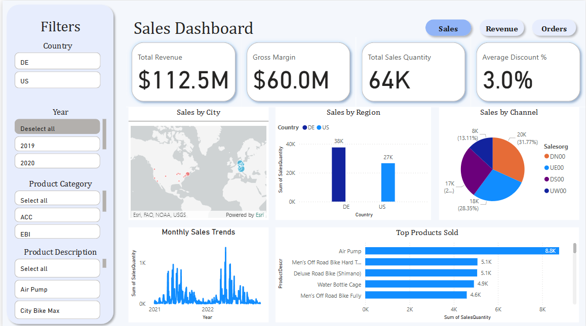

# 📊 Power BI Projects

Welcome to my collection of Power BI projects where data meets design and storytelling. Each project below explores real-world data, offering insights through interactive visuals and dashboards.

---

## 🔷 Projects

### 🏷️ Adidas Sales Analysis
**Objective:** Analyze sales performance for Adidas across regions, product categories, and time.

**Highlights:**
- Region-wise revenue breakdown
- Top-performing product lines
- Time-series trends and seasonal patterns

📂 [adidas-sales-analysis](./adidas-sales-analysis)
📄 Includes: `.xlsx` dataset file

---

### 🚴‍♂️ Bike Sales Dashboard
**Objective:** Create a dynamic dashboard for bike sales, customer segmentation, and performance insights.

**Highlights:**
- Customer demographics & purchase behavior
- Sales trends by region and product type
- Clean UI for executive-level reporting

📂 [bike-sales-dashboard](https://github.com/KlarenceKPIs/bike-sales-dashboard)
📄 Includes: `.pbix` file + preview image

---

## 💼 Tools Used
- **Power BI Desktop**
- Excel (for data cleaning & prep)

---

## 🔗 More Coming Soon...
Stay tuned! More projects are on the way — including finance, marketing, and operational dashboards.

---
